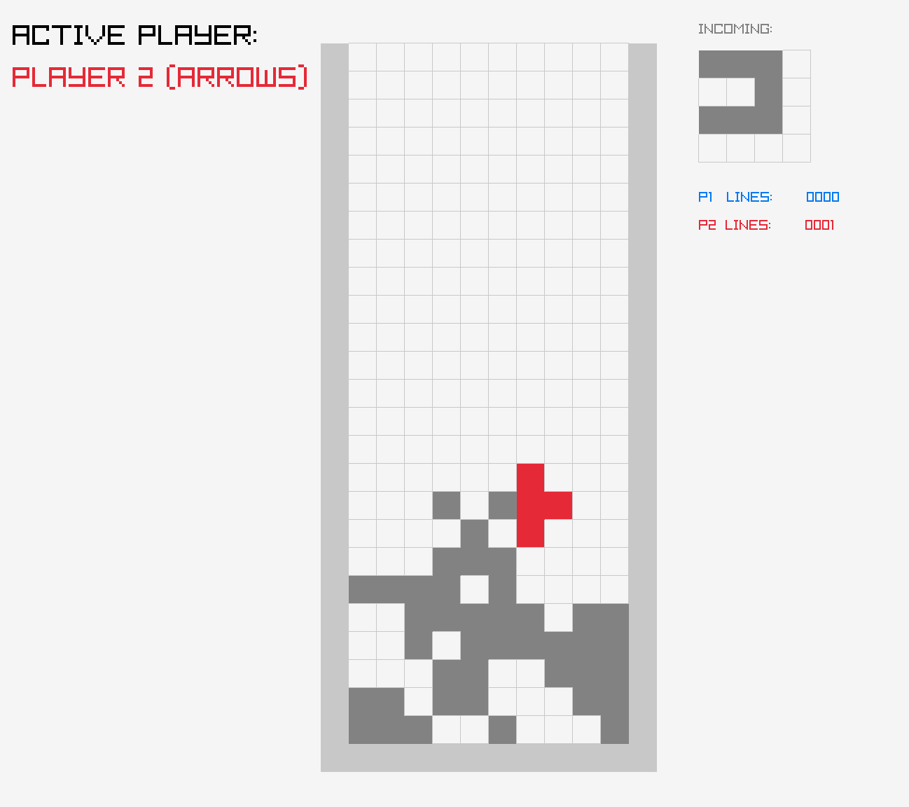
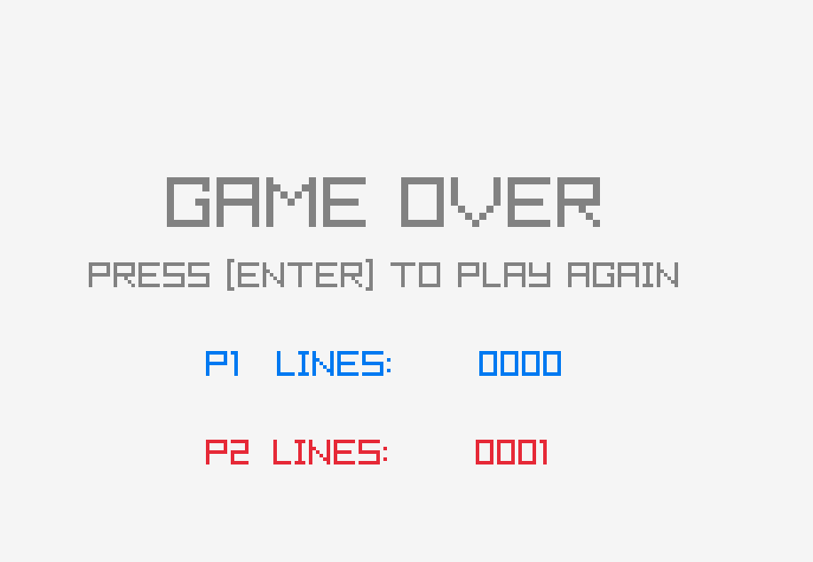
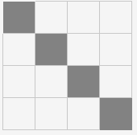
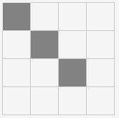
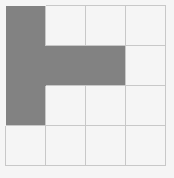
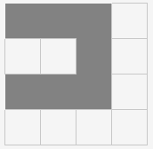
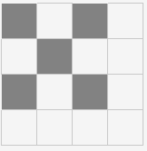
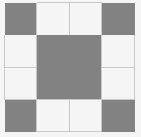

# Tetris - 2 joueurs
## Mini projet de programmation en C et raylib





# Description du projet
- quel jeu a été modifié / étendu ou réalisé ?
> [Tetris](https://www.raylib.com/games.html) (modifié)
- quelle(s) modifications, ... ?
> 1) Ajouter d'autres formes géométriques;
> 2) Créer un mode de jeu à 2 joueurs; 
> 3) Montrer combien de lignes ont explosé pour chaque joueur.
# Comment compiler
```
make all
```
# Comment exécuter
```
./tetris
```
# Comment utiliser le projet
Cette adaptation du jeu Tetris, se joue à deux joueurs. Pour chaque pièce qui apparaît à l'écran, un seul joueur peut la contrôler. 

Si la pièce est bleue, le joueur 1 (P1) peut utiliser les touches WASD pour déplacer la pièce. Si la pièce est rouge, le joueur 2 (P2) doit utiliser les touches fléchées pour déplacer la pièce.

En plus des 6 formes de pièces standard, 7 nouvelles formes ont été ajoutées, comme on peut le voir dans les images ci-dessous :










Lorsque le jeu se termine (lorsqu'une pièce touche le plafond), le score de chaque joueur est affiché à l'écran.

# URL vidéo de démo
# Quelques détails sur votre implémentation
Le code source du jeu est contenu dans un seul fichier appelé `tetris.c`.

Pour créer de nouvelles tuiles, la fonction `GetRandompiece` a été modifiée, pour générer de nouvelles valeurs aléatoires (0 à 13), et les nouvelles formes ont été ajoutées à l'intérieur du commutateur.

Une variable appelée `activePlayer` et la fonction `GetRandomPlayer` ont été créées pour pouvoir ajouter la logique de deux joueurs, et la fonction `GetPieceColor`, qui reçoit `activePlayer` comme argument, a été créée pour pouvoir changer la couleur de la pièce qui est affichée à l'écran en fonction du joueur qui est appelé à jouer.

Pour pouvoir limiter le mouvement de la pièce au seul joueur dessiné, la fonction `ResolveLateralMovement` a été modifiée pour vérifier si la pression sur le clavier fera bouger la pièce ou non selon le joueur actif.

La fonction principale du jeu, `DrawGame`, a également été modifiée, principalement pour montrer des éléments visuels à l'écran. Plusieurs méthodes de `raylib` lui-même ont été utilisées, comme par exemple pour montrer quel joueur est actif, combien de points chaque joueur a, et le score final après la fin du jeu.

# Extensions / améliorations possibles
> 1) Créer un mode de jeu N joueurs (porquoi pas?);
> 2) Tirer au sort une vitesse de pièce différente pour chaque tour;
> 3) Montrer la pièce suivante ainsi que la couleur du joueur suivant sur la petite grille.